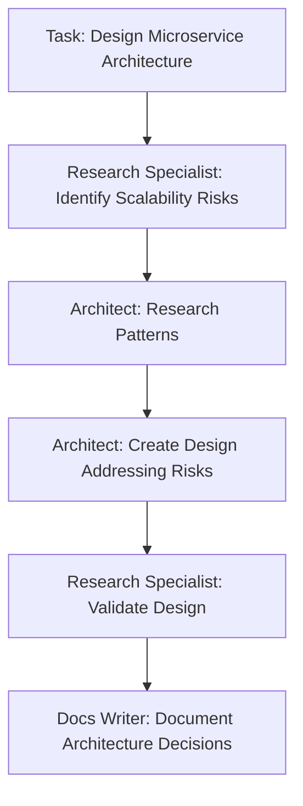
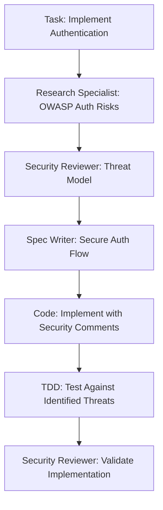

# 🔍 Research Integration Guide

This guide explains how to effectively integrate research tools with your predictive modes for truly evidence-based development.

## Research Tools Integration

### Perplexity AI Integration

The Research Specialist mode works best when connected to Perplexity AI through MCP. To set this up:

1. Get a [Perplexity API key](https://www.perplexity.ai/settings/api)
2. Install [cline](https://microsoft.github.io/cline/)
3. Configure Perplexity in cline:
   ```
   cline mcp providers install perplexity-ai
   ```
4. Follow the prompts to add your API key
5. Copy the MCP server details to Roo Code settings

When properly configured, modes can use tools like:
- `search` - Perform detailed searches on technical topics
- `get_documentation` - Pull up-to-date documentation
- `check_deprecated_code` - Verify if code patterns are current
- `chat_perplexity` - Maintain research context across tasks

### GitHub Tools Integration

For version control, code analysis, and repository management:

1. Create a [GitHub Personal Access Token](https://github.com/settings/tokens) with appropriate scopes
2. Install the GitHub MCP provider in cline:
   ```
   cline mcp providers install github
   ```
3. Follow the prompts to add your token
4. Copy the MCP server details to Roo Code settings

This enables modes to use tools like:
- `create_repository`, `fork_repository` - Manage repositories
- `create_branch`, `list_commits` - Handle branching and history
- `create_issue`, `update_issue`, `create_pull_request` - Manage workflow
- `search_code`, `search_repositories` - Find examples and patterns

## Using the gpt-4o-preview Researcher

The Researcher (gpt-4o-preview) mode uses the OpenAI API directly:

1. Add your OpenAI API key to your project's .env file:
   ```
   OPENAI_API_KEY=your_key_here
   ```
2. The mode will use CLI commands to make API calls to the gpt-4o-search-preview model
3. Use this for:
   - Finding the latest documentation
   - Retrieving current best practices
   - Researching emerging technologies

## Setting Up for Local Development

For the best predictive development experience:

1. Create the following folder structure:
   ```
   project-root/
   ├── .env                   # API keys (gitignored)
   ├── .roomodes              # Copy from custom_modes.json
   ├── docs/
   │   ├── principles.md      # Copy from symbolic_coding_principles.txt
   │   └── research/          # Store research findings here
   ├── .github/
   │   └── workflows/         # CI/CD configurations
   └── src/                   # Your project code
   ```

2. Add to your .gitignore:
   ```
   .env
   *.pem
   *.key
   *.crt
   ```

3. Configure your VS Code for Roo Code:
   - Enable the extension
   - Configure MCP servers
   - Add the symbolic principles to "Custom Coding Instructions (All Modes)"

## Workflow Examples

### Architecture Research Workflow



### Security-First Development Workflow



## Tips for Research-Driven Development

1. **Start with clear research questions**
   - "What are common pitfalls in implementing JWT auth?"
   - "What scalability issues occur with this database approach?"

2. **Document research findings**
   - Store in docs/research/
   - Add citations to code comments
   - Reference in commit messages

3. **Prioritize identified risks**
   - Critical: Security vulnerabilities, data loss scenarios
   - High: Performance bottlenecks, reliability issues
   - Medium: Maintenance challenges, technical debt
   - Low: Style inconsistencies, minor improvements

4. **Create justification patterns in code**
   ```javascript
   // RISK: Rate limiting bypass through distributed attacks
   // RESEARCH: OWASP API Security Top 10 (2023) - API4:2023
   // MITIGATION: IP-based + token-based dual limiting strategy
   function applyRateLimit(req, res, next) {
     // Implementation with dual strategy
   }
   ```

5. **Review based on predicted risks**
   - Did implementation address all identified risks?
   - Were any new risks introduced?
   - Is there evidence/validation of risk mitigation?

## Available Modes Reference

The following modes are available in the updated [`custom_modes.json`](custom_modes.json:1) configuration:

### Core Orchestration
- `sparc` - ⚡️ SPARC Orchestrator 
- `ask` - ❓ Ask 

### Research & Analysis  
- `research-specialist` - 🔍 Research Specialist 
- `researcher` - 🔍 Researcher (gpt-4o-preview)

### Design & Architecture
- `spec-pseudocode` - 📋 Specification Writer 
- `architect` - 🏗️ Architect 
### Development & Implementation
- `code` - 🧠 Auto-Coder 
- `tdd` - 🧪 Tester (TDD)

### Quality & Security
- `debug` - 🪲 Debugger (Root Cause Focused)
- `security-review` - 🛡️ Security Reviewer 
- `code-reviewer` - 🔍 Code Reviewer 

### Documentation & Integration
- `docs-writer` - 📚 Documentation Writer 
- `integration` - 🔗 System Integrator 

### Infrastructure & DevOps
- `devops` - 🚀 DevOps 
- `ci-cd-pipeline` - 🚀 CI/CD Pipeline Engineer 

### Repository Management
- `git-manager` - 🔄 Git Manager 
- `repo-admin` - 🏢 Repository Administrator 
- `issue-tracker` - 📝 Issue Manager

### Monitoring & Optimization
- `post-deployment-monitoring-mode` - 📈 Deployment Monitor 
- `refinement-optimization-mode` - 🧹 Optimizer 

### Specialized Functions
- `devx` - 🧰 DevX 
- `iam-specialist` - 🔐 IAM Specialist 
- `data-engineer` - 🧮 Data Engineer 
- `api-designer` - 🚦 API Designer 
- `tutorial` - 📘 SPARC Tutorial 

For detailed information about each mode, see [`modes-reference.md`](modes-reference.md:1).
By following this guide, you'll maximize the effectiveness of the predictive modes and truly implement research-first development.